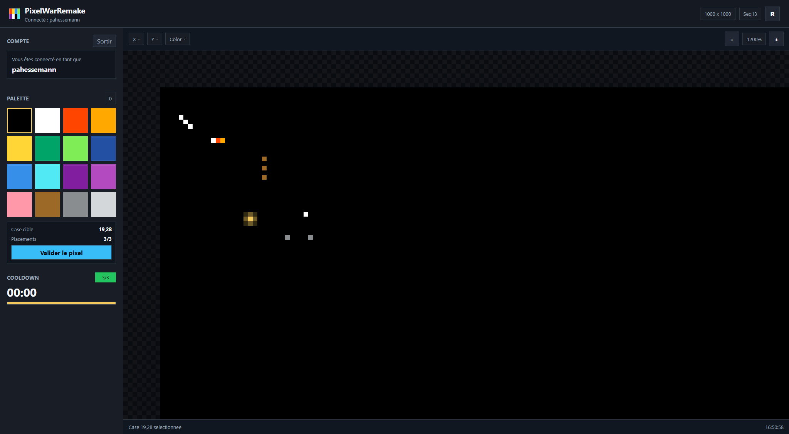

# PixelWarRemake



Serveur Web C++20 pour une carte de pixels persistante. Les utilisateurs se connectent avec Discord, posent des pixels sous quota/cooldown, lisent la carte complete ou recuperent un diff depuis une sequence connue.

## Fonctionnalites

- Serveur HTTP self-contained en C++20 avec thread pool.
- API REST JSON: `/auth/discord`, `/map`, `/pixel`, `/cooldown`.
- Creation de compte uniquement via Discord OAuth2.
- Sessions par token Bearer avec expiration.
- Aucun mot de passe local stocke; les comptes legacy sans Discord sont ignores au chargement.
- Cooldown strict cote serveur.
- Pixel map en memoire protegee par `std::shared_mutex`.
- Persistance binaire de la map avec encodage RLE.
- Cache en memoire de la derniere map compressee.
- Rate limiting simple pour le placement de pixels.
- Documentation OpenAPI dans `docs/openapi.yaml`.
- Frontend web servi par le binaire C++: canvas pixel map, auth, palette, cooldown, zoom et refresh automatique.
- Panel administrateur cache sur `/gestion`, protege par token Bearer Discord et `admin_discord_id`.

## Build

Prerequis:

- CMake 3.20+
- Compilateur C++20

Windows PowerShell:

```powershell
.\scripts\build.cmd
.\scripts\test.cmd
.\scripts\run.cmd
```

Ouvrir ensuite `http://127.0.0.1:8080/` dans le navigateur.

Commande portable:

```bash
cmake -S . -B build
cmake --build build --config Release
./build/pixelwar_server config/server.example.json
```

## Configuration

Copier `config/server.example.json` vers `config/server.json`, puis ajuster:

```json
{
  "host": "0.0.0.0",
  "port": 8080,
  "map_width": 1000,
  "map_height": 1000,
  "palette_size": 16,
  "cooldown_seconds": 600,
  "pixel_quota_per_cooldown": 3,
  "session_ttl_seconds": 86400,
  "thread_pool_size": 8,
  "max_body_bytes": 8192,
  "admin_username": "pahessemann",
  "admin_discord_id": "",
  "public_base_url": "http://127.0.0.1:8080",
  "discord_client_id": "",
  "discord_client_secret": "",
  "discord_redirect_path": "/auth/discord/callback",
  "data_dir": "data"
}
```

Pour activer Discord:

1. Creer une application dans le Discord Developer Portal.
2. Ajouter l'URL de redirection exacte: `http://127.0.0.1:8080/auth/discord/callback` en local.
3. Renseigner `discord_client_id` et `discord_client_secret` dans `config/server.json`, ou utiliser les variables d'environnement `PIXELWAR_DISCORD_CLIENT_ID` et `PIXELWAR_DISCORD_CLIENT_SECRET`.
4. Pour proteger `/gestion` par ton vrai compte Discord, renseigner `admin_discord_id` ou `PIXELWAR_ADMIN_DISCORD_ID`.

Les routes `POST /register` et `POST /login` repondent `410` volontairement: les comptes ne sont plus crees par mot de passe.
Au demarrage, les anciennes entrees password-only de `data/users.db` ne sont pas chargees. Seuls les comptes avec une identite OAuth Discord valide restent utilisables.

## Exemples API

```bash
curl http://localhost:8080/map

# Apres connexion Discord dans le navigateur, recuperer le token de session PixelWarRemake.
TOKEN="..."

curl -X POST http://localhost:8080/pixel \
  -H "Authorization: Bearer $TOKEN" \
  -H "Content-Type: application/json" \
  -d '{"x":10,"y":20,"color":3}'
```

## Payload `/map`

La route renvoie soit une carte complete:

```json
{
  "type": "full",
  "width": 1000,
  "height": 1000,
  "sequence": 42,
  "encoding": "rle-base64",
  "palette_size": 16,
  "data": "..."
}
```

Soit un diff si `GET /map?since=41` peut etre satisfait depuis l'historique en memoire:

```json
{
  "type": "diff",
  "width": 1000,
  "height": 1000,
  "sequence": 42,
  "changes": [{"seq":42,"x":10,"y":20,"color":3}]
}
```

## Frontend

Le dossier `public/` contient l'interface web servie par le serveur C++:

- `index.html`: structure de l'application.
- `admin.html`: panel de gestion accessible via `/gestion`.
- `styles.css`: interface responsive.
- `app.js`: auth Discord, rendu canvas, decode RLE, diffs, cooldown et pose de pixel.
- `admin.js`: statistiques admin, liste utilisateurs et reset cooldown.

Le navigateur appelle `/map` au chargement puis toutes les 60 secondes. Les clics sur le canvas envoient `POST /pixel` avec le token Bearer courant.

Le panel `/gestion` n'est pas lie depuis l'interface publique. Il utilise le token de session Discord stocke par l'interface et refuse tout compte qui ne correspond pas a `admin_discord_id`. Si `admin_discord_id` est vide, `admin_username` reste un fallback, mais seulement pour un compte Discord charge.

## Tests

Le projet cherche Catch2 v3 si disponible. Sinon, un mini runner compatible avec les macros utilisees dans `tests/test_core.cpp` permet de compiler les tests sans dependance externe.

```bash
cmake -S . -B build -DPIXELWAR_BUILD_TESTS=ON
cmake --build build
ctest --test-dir build --output-on-failure
```

Les scenarios de charge et securite sont detailles dans `docs/testing.md`.

## Workflow Git recommande

```bash
git config user.name "Paul Hessemann"
git config user.email "ton_email"

git checkout -b dev
git checkout -b feature/pixel-api
git commit -m "[feature] Ajout endpoint /pixel"
```

Branches:

- `main`: stable
- `dev`: developpement
- `feature/*`: nouvelles fonctionnalites
